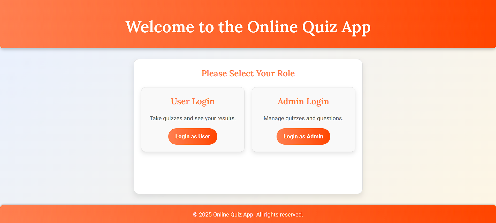

# Online Quiz Application

This is a web-based Online Quiz Application built using **Java Servlets**, **JSP**, **JDBC**, **Oracle Database**, and **HTML/CSS/JavaScript**, running on an **Apache Tomcat server**. The project follows the **MVC architecture**.

---

## Features

### User Features:
1. **Registration**: Users can sign up by providing a username, password, email, and full name.
2. **Login**: Users can log in using their credentials.
3. **Browse Quizzes**: Users can view the list of available quizzes.
4. **Attempt Quiz**: Users can take quizzes by selecting answers to questions.
5. **View Results**: After submitting a quiz, users can see their score and percentage.
6. **Logout**: Users can securely log out of the application.

### Admin Features:
1. **Login**: Admins can log in using their credentials.
2. **Manage Quizzes**: Admins can view and delete quizzes.
3. **View Results**: Admins can see the results of quizzes submitted by users.
4. **Logout**: Admins can securely log out of the application.

---

## Database Schema

### Tables

#### 1. `users`
| Column       | Null?  | Type          |
|--------------|--------|---------------|
| USERNAME     | NOT NULL | VARCHAR2(50) |
| PASSWORD     | NOT NULL | VARCHAR2(50) |
| EMAIL        |          | VARCHAR2(100) |
| FULL_NAME    |          | VARCHAR2(100) |

#### 2. `admins`
| Column       | Null?  | Type          |
|--------------|--------|---------------|
| ADMIN_ID     | NOT NULL | NUMBER       |
| USERNAME     | NOT NULL | VARCHAR2(50) |
| PASSWORD     | NOT NULL | VARCHAR2(50) |

#### 3. `questions`
| Column          | Null?  | Type           |
|-----------------|--------|----------------|
| QUESTION_ID     | NOT NULL | NUMBER        |
| QUIZ_ID         |          | NUMBER        |
| QUESTION_TITLE  | NOT NULL | VARCHAR2(500) |
| OPTION1         |          | VARCHAR2(200) |
| OPTION2         |          | VARCHAR2(200) |
| OPTION3         |          | VARCHAR2(200) |
| OPTION4         |          | VARCHAR2(200) |
| CORRECT_ANSWER  |          | NUMBER        |

#### 4. `quiz`
| Column       | Null?  | Type          |
|--------------|--------|---------------|
| QUIZ_ID      | NOT NULL | NUMBER       |
| QUIZ_TITLE   | NOT NULL | VARCHAR2(100) |

#### 5. `results`
| Column       | Null?  | Type          |
|--------------|--------|---------------|
| USERNAME     | NOT NULL | VARCHAR2(50) |
| QUIZ_ID      | NOT NULL | NUMBER       |
| SCORE        | NOT NULL | NUMBER       |
| PERCENTAGE   | NOT NULL | NUMBER(5,2)  |

---

## Project Setup

1. **Clone the Repository**:
   ```bash
   git clone <repository-url>
   cd <repository-folder>
   ```

2. **Set Up the Database**:
   - Import the provided SQL file or manually create the tables mentioned above in Oracle Database.

3. **Configure Database Connection**:
   - Update the database connection details (URL, username, password) in the `db.properties` file or directly in the JDBC connection class.

4. **Deploy the Application**:
   - Copy the project folder to the `webapps` directory of Apache Tomcat.
   - Start the Tomcat server using:
     ```bash
     <tomcat-folder>/bin/startup.sh
     ```

5. **Access the Application**:
   - Open a browser and navigate to `http://localhost:8080/<project-name>`.

---

## Technology Stack

- **Backend**: Java (Servlets, JSP)
- **Frontend**: HTML, CSS, JavaScript
- **Database**: Oracle
- **Server**: Apache Tomcat

---

## Project Architecture

This project is structured following the **Model-View-Controller (MVC)** design pattern:

- **Model**: Contains database interaction logic.
- **View**: Includes JSP pages for UI.
- **Controller**: Includes servlets to handle requests and responses.

---

## How to Use the Application

### As a User:
1. Register an account.
2. Log in using your credentials.
3. View available quizzes.
4. Attempt a quiz by answering questions.
5. Submit the quiz to see your score and percentage.
6. Log out after completing your session.

### As an Admin:
1. Log in using your credentials.
2. View the list of quizzes.
3. Delete any unwanted quizzes.
4. View quiz results submitted by users.
5. Log out after completing your tasks.

---

## Contribution Guidelines

1. Fork the repository.
2. Create a new branch for your feature or bug fix.
3. Commit your changes with a descriptive message.
4. Push to your forked repository.
5. Create a pull request to the main branch.

---

## License

This project is licensed under the MIT License. Feel free to use and modify it for your own purposes.




